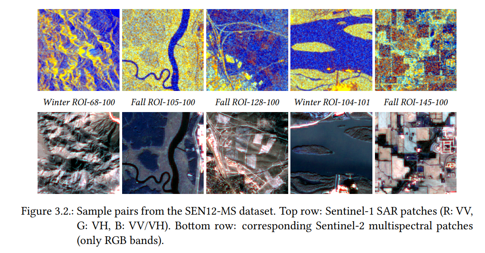
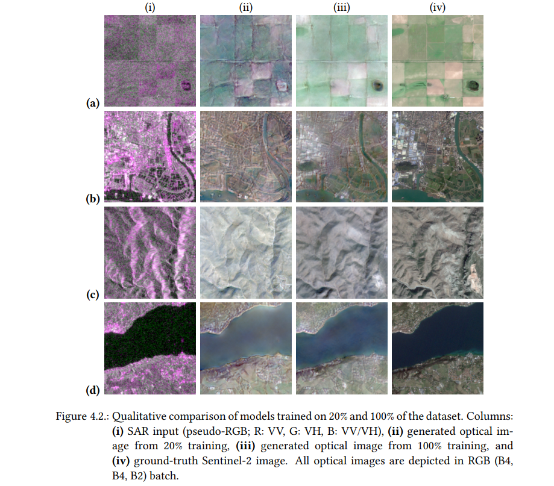
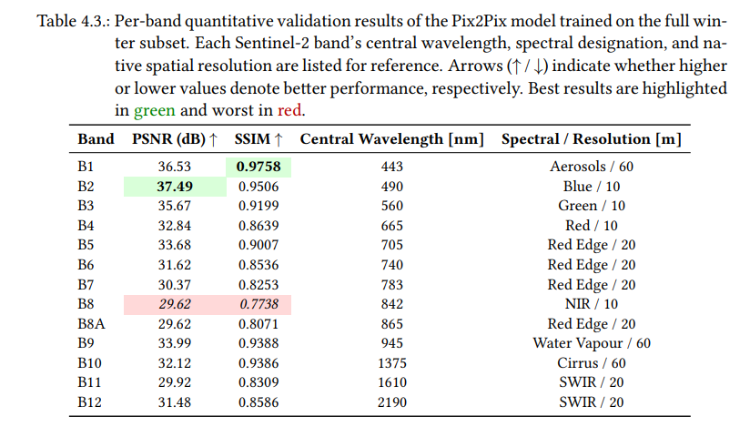
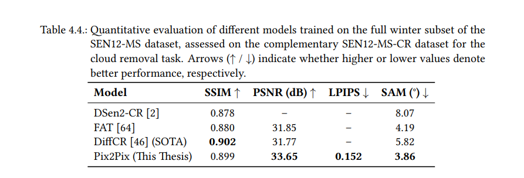
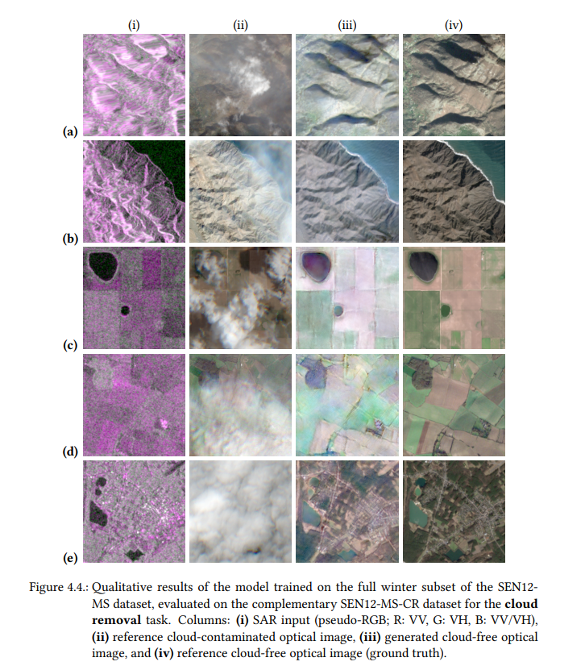
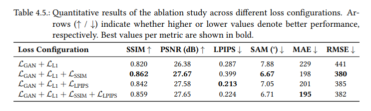
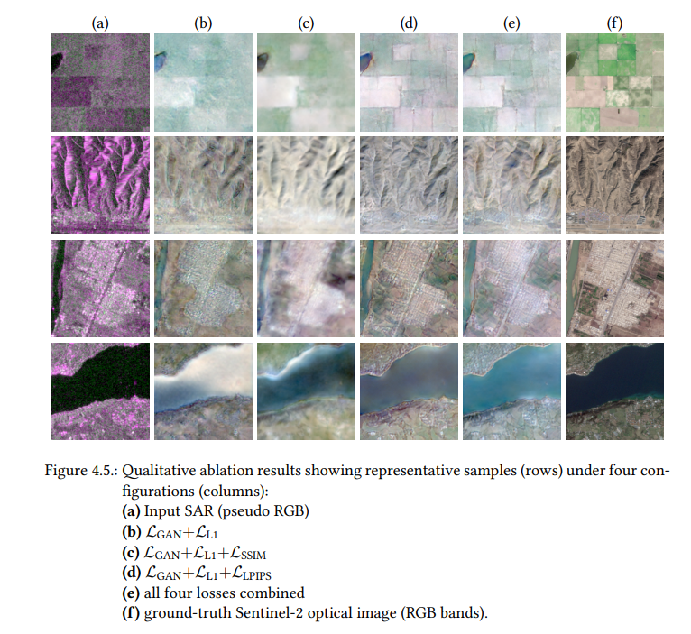
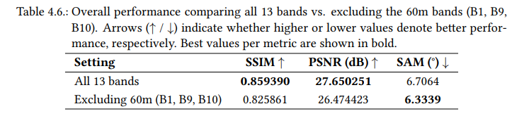
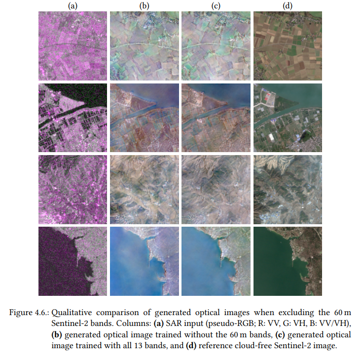

***
Hi there!
This is the repo for my bachelor thesis on the topic of:

**_Generation of optical remote sensing data (Sentinel-2) based on radar remote sensing data (Sentinel-1) using generative AI._**

AKA: _SAR-to-Optical image translation_

***
**Note:** Since this thesis contains more than what is illustrated here and was conducted over several months, it is highly recommended to refer to or read the thesis document—or relevant parts depending on your needs—which can be found [here](latex_source_code/main.pdf).

## Motivation
Optical remote sensing data provide rich information used, among other applications, in forest and agricultural monitoring. However, they are inherently constrained by atmospheric conditions such as illumination variability and, in particular, **cloud cover**, which creates temporal gaps in acquisition. 
Synthetic Aperture Radar (SAR), in contrast, operates in the microwave domain, offering all-weather, day-and-night imaging capabilities independent of sunlight or cloud interference. 
Using Generative AI (GenAI), this thesis addresses this problem by translating from the SAR domain to the optical domain using freely available Sentinel-1 and Sentinel-2 data provided by the [Copernicus Mission](https://www.copernicus.eu/en).

## Dataset
This thesis relies exclusively on the [SEN12-MS](https://arxiv.org/abs/1906.07789) dataset. SEN12-MS is a large-scale, globally distributed benchmark designed to advance research in multimodal Earth observation and deep learning. 
It comprises dual-polarized Sentinel-1 SAR data in VV and VH polarization (σ° backscatter values in decibel scale) and full Sentinel-2 multispectral imagery spanning all 13 bands. Sample pairs are shown below.

## Pix2Pix Model
The generative model used for this image translation task is the well-known [Pix2Pix](https://arxiv.org/abs/1611.07004) model (with minor modifications; refer to the thesis document for more details). Pix2Pix is based on conditional generative adversarial networks (cGANs), which extend the original GAN formulation by conditioning both the generator and discriminator on an input image. All experiments were implemented in Python 3.11, PyTorch 2.4.0, and CUDA 12.4 using the Pix2Pix [PyTorch implementation](https://github.com/junyanz/pytorch-CycleGAN-and-pix2pix). Training was conducted on an NVIDIA RTX A5000 GPU with CUDA acceleration.

**Loss Function:** Based on an ablation study conducted in the thesis (see Section 4.5.1), a combination of different losses was used for training: Least Squares GAN (LSGAN), L1 (MAE), Learned Perceptual Image Patch Similarity (LPIPS), and Structural Similarity Index Measure (SSIM).  
The overall objective function can be expressed as:

$$ \mathcal{L}_{\text{total}} = \mathcal{L}_{\text{GAN}} + \lambda_{L1} \ \mathcal{L}_{L1} + \lambda_{\text{SSIM}} \ \mathcal{L}_{\text{SSIM}} + \lambda_{\text{LPIPS}} \ \mathcal{L}_{\text{LPIPS}} $$

**Evaluation Metrics:** The effectiveness of SAR-to-optical image translation depends not only on the choice of models but also on the evaluation methods. Accordingly, the study evaluates SAR-to-optical translation using a mix of pixel, structural, spectral, and perceptual metrics. **PSNR**, **SSIM**, and **SAM** capture fidelity at pixel, structural, and multispectral levels. **MAE** and **RMSE** provide additional error-based validation. **LPIPS** complements these by measuring perceptual realism through deep feature comparisons. The formulas, advantages, and limitations of each metric are described in Section 3.5 of the thesis, along with an analysis of the most frequently used metrics in the literature.

## Results
1. **Training on 20% and the full winter subset of SEN12-MS**

   

2. **Per-band validation results for full dataset training**  
   

3. **Results on cloud removal using the [SEN12-MS-CR](https://ieeexplore.ieee.org/document/9211498) dataset**

   

   

5. **Ablation Study on the Effect of Loss Functions**

   

   

6. **Ablation Study on the Effect of Excluding 60m Bands**

   

   

## Conclusion
This thesis investigates SAR-to-optical translation as a way to generate multispectral optical imagery from radar data, reducing the impact of cloud contamination. Using Sentinel-1/2 pairs from SEN12-MS and a Pix2Pix cGAN, the model successfully reconstructed all 13 Sentinel-2 bands, confirming meaningful spatial and spectral relationships between SAR and optical data. Performance varied across bands and scene types, but the approach produced high-fidelity, cloud-free outputs and performed on par with or better than several existing methods.

Ablation studies showed that adding SSIM and LPIPS losses improves reconstruction stability and perceptual quality. The work also identifies a key preprocessing issue: uniform clipping across optical bands can degrade spectral accuracy. Remaining challenges include weaker performance in spectrally complex or textureless areas and limited temporal generalization due to winter-only training.

The results demonstrate that GAN-based generative models can produce full-spectrum optical imagery from SAR with competitive accuracy, highlighting their potential to enhance optical remote sensing continuity under difficult observation conditions.
